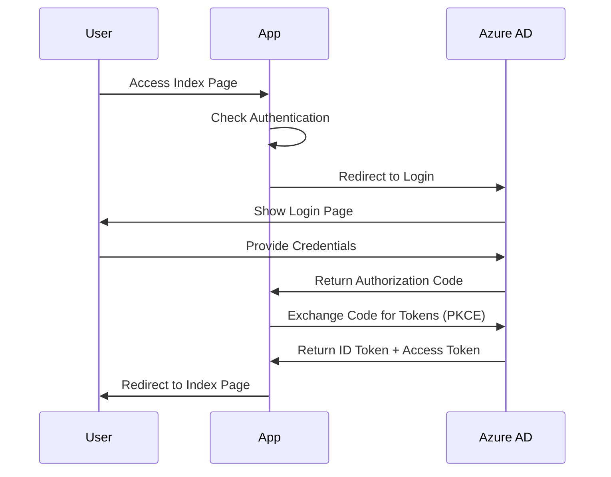
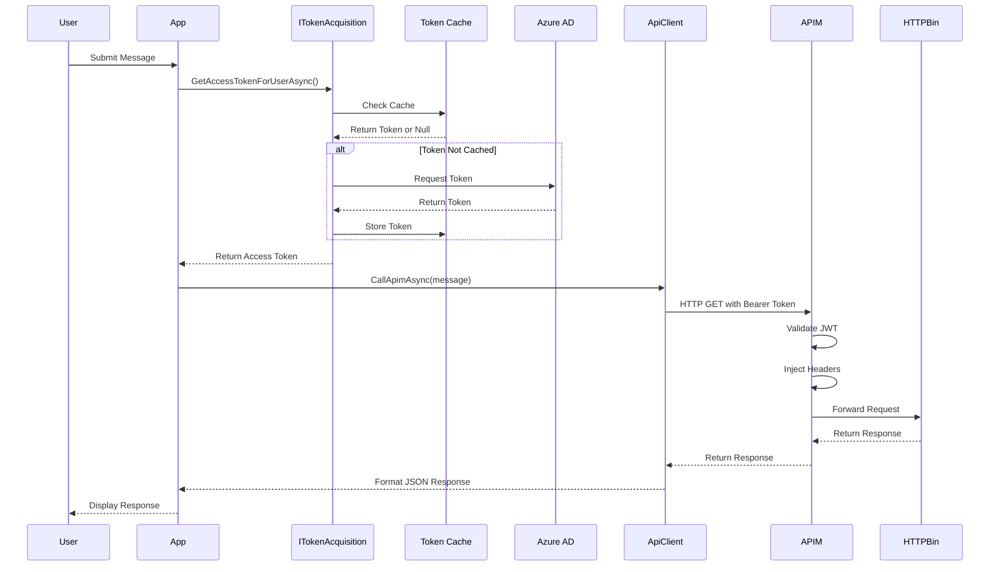

# Application Architecture

This document details the architecture of the .NET client application that demonstrates OAuth 2.0 On-Behalf-Of (OBO) flow.

## Table of Contents

- [Overview](#overview)
- [Application Structure](#application-structure)
- [Core Components](#core-components)
- [Token Acquisition Services](#token-acquisition-services)
- [Configuration Management](#configuration-management)
- [Dependency Injection](#dependency-injection)
- [Related Documentation](#related-documentation)

## Overview

The client application is an ASP.NET Core 9.0 web application that:
- Authenticates users via Azure AD using Authorization Code Flow with PKCE
- Acquires tokens for downstream API calls using environment-aware strategies
- Makes authenticated API calls through Azure APIM
- Provides a chat-like UI for testing and demonstration

**Technology Stack:**
- .NET 9.0
- ASP.NET Core MVC with Razor Pages
- Microsoft.Identity.Web for authentication
- MSAL (Microsoft Authentication Library) for token acquisition
- Docker for containerization

## Application Structure

```
src/client/
├── Program.cs                     # Application startup and configuration
├── appsettings.json              # Base configuration
├── appsettings.Development.json  # Development overrides
├── Pages/
│   ├── Index.cshtml              # Chat interface UI
│   ├── Index.cshtml.cs           # Chat page model and logic
│   └── Shared/
│       ├── _Layout.cshtml        # Application layout
│       └── _LoginPartial.cshtml  # Login/logout UI component
├── Services/
│   ├── ITokenAcquisitionService.cs       # Token acquisition interface
│   ├── WorkloadIdentityTokenService.cs   # AKS production implementation
│   ├── ClientSecretTokenService.cs       # Local development implementation
│   └── ApiClient.cs                      # APIM integration service
├── wwwroot/
│   ├── css/                      # Stylesheets
│   ├── js/                       # JavaScript
│   └── lib/                      # Client libraries
├── Dockerfile                     # Container image definition
└── client.csproj                  # Project configuration
```

## Core Components

### 1. Program.cs - Application Startup

The `Program.cs` file contains the application bootstrap logic and dependency injection configuration.

**Key Responsibilities:**
- Configure authentication services
- Register environment-aware token acquisition service
- Set up session management
- Configure authorization policies
- Add Razor Pages with Microsoft Identity UI

**Environment Detection:**
```csharp
var environment = builder.Configuration["ENVIRONMENT"] ?? "Development";
var isProduction = environment.Equals("Production", StringComparison.OrdinalIgnoreCase);
```

**Service Registration:**
```csharp
if (isProduction)
{
    builder.Services.AddSingleton<ITokenAcquisitionService, WorkloadIdentityTokenService>();
}
else
{
    builder.Services.AddSingleton<ITokenAcquisitionService, ClientSecretTokenService>();
}
```

### 2. Pages/Index - Chat Interface

The chat interface provides an interactive way to test the OAuth OBO flow.

**Features:**
- Real-time message submission
- API response display with JSON formatting
- Chat history maintained in session
- Clear history and logout functionality
- Authentication status indication

**User Flow:**
1. User signs in via Azure AD
2. User types a message in the chat interface
3. Application acquires OBO token
4. Application calls APIM with Bearer token
5. Response displayed with injected headers visible

### 3. Services/ApiClient

The `ApiClient` service handles communication with Azure APIM.

**Responsibilities:**
- Acquire access tokens for the API scope
- Create HTTP requests with proper authentication headers
- Send requests to APIM endpoints
- Parse and format JSON responses
- Handle errors and exceptions

**Token Acquisition:**
```csharp
var scope = $"api://{apiAppId}/{oauthScope}";
var accessToken = await _tokenAcquisition.GetAccessTokenForUserAsync(new[] { scope });
```

**Request Construction:**
```csharp
var request = new HttpRequestMessage(HttpMethod.Get, $"{apimBaseUrl}/test");
request.Headers.Authorization = new AuthenticationHeaderValue("Bearer", accessToken);
request.Headers.Add("X-User-Message", message);
```

## Token Acquisition Services

The application uses an interface-based approach to support different token acquisition strategies based on the deployment environment.

### Interface: ITokenAcquisitionService

```csharp
public interface ITokenAcquisitionService
{
    Task<string> AcquireTokenForUserAsync(string[] scopes);
    Task<string> AcquireTokenOnBehalfOfAsync(string userToken, string[] scopes);
}
```

### Production: WorkloadIdentityTokenService

Used in AKS production environment with Azure Workload Identity.

**Key Features:**
- No client secrets required
- Uses `DefaultAzureCredential` with managed identity
- Federated credential exchange with Kubernetes service account
- Token assertion for confidential client flows

**Implementation Details:**

**Initialization:**
```csharp
_azureCredential = new DefaultAzureCredential(new DefaultAzureCredentialOptions
{
    ManagedIdentityClientId = clientId
});

_confidentialClientApp = ConfidentialClientApplicationBuilder
    .Create(clientId)
    .WithAuthority(new Uri(authority))
    .WithClientAssertion(async (AssertionRequestOptions options) =>
    {
        var tokenRequestContext = new TokenRequestContext(
            new[] { "api://AzureADTokenExchange/.default" }
        );
        var token = await _azureCredential.GetTokenAsync(tokenRequestContext);
        return token.Token;
    })
    .Build();
```

**Token Acquisition:**
```csharp
public async Task<string> AcquireTokenForUserAsync(string[] scopes)
{
    var tokenRequestContext = new TokenRequestContext(scopes);
    var token = await _azureCredential.GetTokenAsync(tokenRequestContext);
    return token.Token;
}
```

**On-Behalf-Of Flow:**
```csharp
public async Task<string> AcquireTokenOnBehalfOfAsync(string userToken, string[] scopes)
{
    var userAssertion = new UserAssertion(userToken);
    var result = await _confidentialClientApp
        .AcquireTokenOnBehalfOf(scopes, userAssertion)
        .ExecuteAsync();
    return result.AccessToken;
}
```

### Development: ClientSecretTokenService

Used in local development environment with traditional client credentials.

**Key Features:**
- Uses client secret for authentication
- Simpler setup for local development
- Full MSAL confidential client capabilities
- Compatible with standard OAuth flows

**Implementation Details:**

**Initialization:**
```csharp
_confidentialClientApp = ConfidentialClientApplicationBuilder
    .Create(clientId)
    .WithClientSecret(clientSecret)
    .WithAuthority(new Uri(authority))
    .Build();
```

**Token Acquisition:**
```csharp
public async Task<string> AcquireTokenForUserAsync(string[] scopes)
{
    var result = await _confidentialClientApp
        .AcquireTokenForClient(scopes)
        .ExecuteAsync();
    return result.AccessToken;
}
```

**On-Behalf-Of Flow:**
```csharp
public async Task<string> AcquireTokenOnBehalfOfAsync(string userToken, string[] scopes)
{
    var userAssertion = new UserAssertion(userToken);
    var result = await _confidentialClientApp
        .AcquireTokenOnBehalfOf(scopes, userAssertion)
        .ExecuteAsync();
    return result.AccessToken;
}
```

## Configuration Management

### Environment Variables

The application reads configuration from environment variables:

| Variable | Purpose | Required In |
|----------|---------|-------------|
| `ENVIRONMENT` | Deployment environment (Production/Development) | All |
| `AZURE_CLIENT_ID` | Azure AD client application ID | All |
| `AZURE_TENANT_ID` | Azure AD tenant ID | All |
| `API_APP_ID` | Backend API application ID | All |
| `OAUTH_SCOPE` | OAuth scope name (default: access_as_user) | All |
| `APIM_BASE_URL` | Azure APIM base URL | All |
| `AZURE_CLIENT_SECRET` | Client secret for authentication | Development only |

### Configuration Hierarchy

1. **Environment Variables**: Highest priority (runtime configuration)
2. **appsettings.Development.json**: Development overrides
3. **appsettings.json**: Base configuration
4. **Kubernetes ConfigMap/Secret**: Container environment values

### Kubernetes Integration

In Kubernetes deployments, configuration is provided via:

**ConfigMap:**
```yaml
apiVersion: v1
kind: ConfigMap
metadata:
  name: oauth-obo-client-config
data:
  ENVIRONMENT: "Production"
  AZURE_CLIENT_ID: "client-app-id"
  AZURE_TENANT_ID: "tenant-id"
  API_APP_ID: "api-app-id"
  OAUTH_SCOPE: "access_as_user"
  APIM_BASE_URL: "https://apim-name.azure-api.net/httpbin"
```

**Secret (Development only):**
```yaml
apiVersion: v1
kind: Secret
metadata:
  name: oauth-obo-client-credentials
type: Opaque
stringData:
  AZURE_CLIENT_SECRET: "client-secret"
```

## Dependency Injection

### Service Registration

**Authentication Services:**
```csharp
builder.Services.AddAuthentication(OpenIdConnectDefaults.AuthenticationScheme)
    .AddMicrosoftIdentityWebApp(options => { /* configuration */ })
    .EnableTokenAcquisitionToCallDownstreamApi(downstreamApiScopes)
    .AddInMemoryTokenCaches();
```

**Token Acquisition Service (Environment-Aware):**
```csharp
if (isProduction)
    builder.Services.AddSingleton<ITokenAcquisitionService, WorkloadIdentityTokenService>();
else
    builder.Services.AddSingleton<ITokenAcquisitionService, ClientSecretTokenService>();
```

**API Client:**
```csharp
builder.Services.AddHttpClient<ApiClient>();
```

**Session Support:**
```csharp
builder.Services.AddDistributedMemoryCache();
builder.Services.AddSession(options =>
{
    options.IdleTimeout = TimeSpan.FromMinutes(30);
    options.Cookie.HttpOnly = true;
    options.Cookie.IsEssential = true;
});
```

### Service Lifetimes

| Service | Lifetime | Rationale |
|---------|----------|-----------|
| `ITokenAcquisitionService` | Singleton | Maintains token cache across requests |
| `ApiClient` | Scoped | One instance per HTTP request |
| `ITokenAcquisition` (Microsoft.Identity.Web) | Scoped | Per-request token operations |
| `HttpClient` | Transient | Managed by HttpClientFactory |

## Authentication Flow

### User Sign-In Flow



### API Call Flow



## Error Handling

### Token Acquisition Errors

**Handled Scenarios:**
- Configuration missing or invalid
- Token acquisition failure
- Authentication errors
- Network connectivity issues

**Error Response:**
```csharp
catch (MsalException ex)
{
    _logger.LogError(ex, "Failed to acquire OBO token");
    throw;
}
```

### API Call Errors

**Handled Scenarios:**
- HTTP errors (4xx, 5xx)
- Network timeouts
- JSON parsing errors
- APIM policy violations

**Error Response Format:**
```csharp
if (!response.IsSuccessStatusCode)
{
    var errorContent = await response.Content.ReadAsStringAsync();
    return $"Error: {response.StatusCode}\n{errorContent}";
}
```

## Logging

### Log Categories

- **Authentication**: User sign-in/sign-out events
- **Token Acquisition**: Token request and caching
- **API Calls**: APIM request/response logging
- **Errors**: Exception details and stack traces

### Log Levels

| Level | Usage |
|-------|-------|
| Information | Normal operations (token acquired, API call success) |
| Warning | Recoverable issues (token cache miss) |
| Error | Failures requiring attention (authentication failure) |

### Example Log Output

```
info: client.Services.WorkloadIdentityTokenService[0]
      WorkloadIdentityTokenService initialized for AKS production environment
info: client.Services.ApiClient[0]
      Acquiring access token for scope: api://379eb22e-22d4-4990-8fdc-caef12894896/access_as_user
info: client.Services.ApiClient[0]
      Access token acquired, calling APIM at https://apim-oauthpoc.azure-api.net/httpbin
info: client.Services.ApiClient[0]
      APIM call successful
```

## Performance Considerations

### Token Caching

- **In-Memory Cache**: MSAL maintains token cache in memory
- **Cache Duration**: Tokens cached until expiration (typically 1 hour)
- **Automatic Refresh**: MSAL handles token refresh automatically
- **Cache Key**: User identity + scope

### HTTP Client Management

- **HttpClientFactory**: Manages HTTP client lifecycle
- **Connection Pooling**: Reuses connections to APIM
- **Timeout Configuration**: Default 100 seconds
- **Retry Logic**: Not implemented (relies on APIM resilience)

### Session Management

- **Storage**: Distributed memory cache (in-memory)
- **Timeout**: 30 minutes idle timeout
- **Cookie**: HTTP-only, essential
- **Scope**: Per-user session data

## Security Best Practices

### Token Handling

- ✅ Never log access tokens
- ✅ Use HTTPS for all communication
- ✅ Store tokens in memory cache only
- ✅ Validate tokens before use
- ✅ Use short-lived tokens (1 hour default)

### Secret Management

- ✅ Client secrets only in Development environment
- ✅ No secrets in source code
- ✅ Secrets provided via environment variables
- ✅ Production uses workload identity (no secrets)

### Authentication Security

- ✅ Authorization Code Flow with PKCE
- ✅ State parameter for CSRF protection
- ✅ Nonce validation in ID tokens
- ✅ HTTPS redirect URIs only

## Related Documentation

- [Architecture Overview](overview.md)
- [Azure AD Configuration](azure-ad.md)
- [Kubernetes Architecture](kubernetes.md)
- [Security Architecture](security.md)
- [Source Code Documentation](../../src/client/README.md)
- [Developer Guide](../development/guide.md)
- [Deployment Guide](../deployment/application.md)
